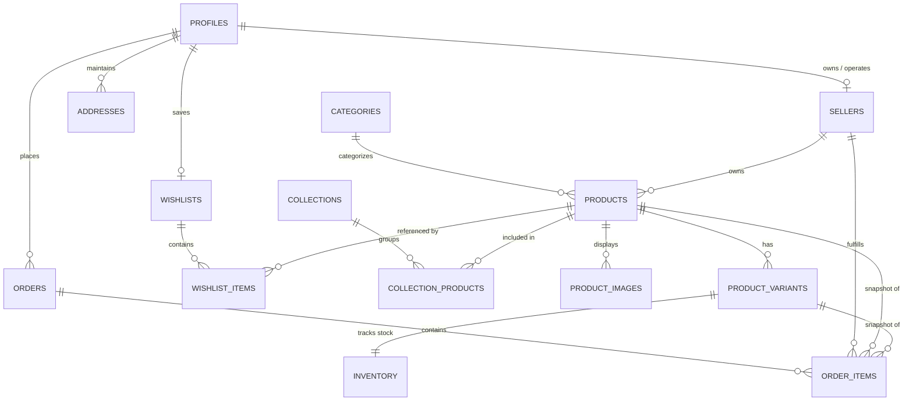

# SENO Fashion Marketplace - Database Architecture & Migration Guide

This directory contains the database schema, security rules, and migrations for the **SENO** multi-vendor fashion marketplace built on Supabase (PostgreSQL).

---

## 1. Schema Overview

The database is composed of **16 core tables** separated into four main functional domains, backed by security-hardened functions, triggers, and Row Level Security:

### Core Catalog & Vendors
1. **`profiles`**: Extends Supabase `auth.users` with user roles (`customer`, `admin`, `reseller`). All new user signups default securely to `customer`. Privileged roles (`reseller`, `admin`) can never be assigned via client signup metadata.
2. **`sellers`**: Unified seller entity supporting both the SENO direct brand (`platform`) and independent sellers (`reseller`). Tracks store details, approval status (`pending`, `approved`, `suspended`, `rejected`), commission percentage, and payout metadata. Sensitive fields (`payout_details`, `commission_rate`, contact info) are protected from public access.
   - **`sellers_public` View**: Safe public view exposing only storefront details (`id`, `store_name`, `slug`, `description`, `logo_url`, `banner_url`, `created_at`) for approved sellers.
3. **`categories`**: Product taxonomy (e.g. Topwear, Bottomwear, Outerwear, Accessories).
4. **`collections`**: Curated product groupings and seasonal campaigns.
5. **`collection_products`**: Join table establishing visual curation order for collections.
6. **`products`**: Central product records with seller ownership, independent merchandising flags (`is_featured`, `is_new`, `is_bestseller`), manual featured ordering, mandatory positive default weight, and review workflow status (`draft`, `submitted`, `approved`, `rejected`).
7. **`product_images`**: Multi-asset gallery with display ordering and primary image flags. Enforces **at most one primary image per product** via a database unique partial index.
8. **`product_variants`**: Size and colour combinations with unique SKUs, optional price overrides, and optional weight overrides. Enforces **uniqueness per (product, size, colour)** handling nulls gracefully.
9. **`inventory`**: Stock tracking per variant with customizable low-stock alert thresholds.

### Customer Domain
10. **`addresses`**: User delivery and billing addresses with default address designation.
11. **`wishlists`**: User wishlist container.
12. **`wishlist_items`**: Wishlist product references with uniqueness guards.

### Multi-Vendor Orders
13. **`orders`**: Unified customer order record. Supports single checkouts containing items from multiple sellers. Direct client-side `INSERT` is omitted to prevent client tampering of prices or totals. Orders must be placed through trusted server-side execution.
14. **`order_items`**: Line-item financial snapshots capturing product name, SKU, variant details, unit price, unit weight, quantity, commission rate, and seller payout amount. Preserves historical order integrity if future product prices change, and enables independent seller fulfillment tracking (`unfulfilled`, `processing`, `shipped`, `delivered`, `cancelled`).

### Dynamic Shipping Configuration
15. **`shipping_settings`**: Global shipping controls with an explicit `calculation_mode` toggle (`base_incremental` or `weight_slab`), base rate/weight, incremental rate/weight, and optional free-shipping order threshold. Enforces **strictly one active configuration** via a database partial unique index.
16. **`shipping_weight_rules`**: Configurable weight tiers (min weight, max weight, rate) for weight slab pricing. Enforces **non-overlapping active weight slabs** via a validation trigger.

---

## 2. Entity Relationship Summary



---

## 3. Seller Ownership & Product Workflow

### Ownership Guarantee
- Every product requires a `seller_id` pointing to `public.sellers`.
- Product ownership is enforced at the database level:
  - **Reseller product creation**: The database automatically attaches the authenticated user's approved seller ID (`public.get_current_seller_id()`). Resellers cannot submit an arbitrary `seller_id`.
  - **Immutability**: `products.seller_id` is protected by trigger `trg_enforce_product_rules` and cannot be altered once created.
  - **Admin products**: In Stage 1, products created by administrators must strictly belong to the SENO platform seller. If omitted, `seller_id` is automatically assigned to the platform seller ID; if an administrator attempts to assign any non-platform seller ID, the insert is rejected.

### Lifecycle & Review States
- **Platform products**: Automatically created in `approved` status with `published_at` set immediately.
- **Reseller products**:
  - Resellers can create products as `draft` or `submitted`.
  - Cannot self-approve: Attempting to set `approval_status = 'approved'` from a non-admin account raises a database error.
  - Admins can approve or reject with a `rejection_reason`.
  - **Material edits to approved products**: If a reseller alters material fields (`name`, `category_id`, `description`, `details`, `price`, `compare_at_price`, `default_weight_grams`) on an already-approved product, the trigger automatically resets the product's status to `submitted` (or `draft`) and clears `published_at`, requiring re-review before becoming publicly visible again.
  - When a reseller updates a rejected product and resubmits (`submitted`), `rejection_reason` is cleared for review.

---

## 4. Product & Variant Weight Inheritance

- **Product Level (`products.default_weight_grams`)**:
  - **MANDATORY (`NOT NULL`)** and must be strictly positive (`CHECK (default_weight_grams > 0)`).
- **Variant Level (`product_variants.weight_grams_override`)**:
  - **OPTIONAL (`NULL` allowed)**.
- **Shipping Calculation Inheritance**:
  - If `product_variants.weight_grams_override` is specified, application logic uses this variant weight.
  - If `product_variants.weight_grams_override IS NULL`, calculation falls back to `products.default_weight_grams`.

---

## 5. Shipping Configuration Model

The marketplace shipping calculation is dynamic and database-driven:

### Single Active Mode via `calculation_mode`
`shipping_settings.calculation_mode` restricts active calculation to either:
1. `'base_incremental'`:
   - `base_weight_grams` (e.g. 500g) at `base_rate` (e.g. ₹70).
   - Additional weight billed in increments of `incremental_weight_grams` (e.g. 500g) at `incremental_rate` (e.g. ₹20).
2. `'weight_slab'`:
   - Evaluates active rules in `shipping_weight_rules` where `min_weight_grams <= total_shipment_weight < max_weight_grams`.
   - The validation trigger `validate_shipping_weight_slab` strictly prevents overlapping weight slabs.

### Single Active Setting Enforcement
- A partial unique index `uq_shipping_settings_single_active` prevents multiple simultaneous active rows in `shipping_settings`.

### Free Shipping Threshold
- If `free_shipping_threshold` is configured and order subtotal exceeds this amount, shipping fee is waived.
- Calculation formulas run in trusted backend server actions, reading from these database tables.

---

## 6. Row Level Security (RLS) & Security Hardening

Row Level Security is enabled on **all 16 tables**. All `SECURITY DEFINER` functions run with `SET search_path = public, pg_temp;` to mitigate search_path poisoning.

| Table | Public Access | Customer / Owner Access | Reseller Access | Admin Access |
|---|---|---|---|---|
| `profiles` | None | Read/Update own record | Read/Update own record | Full Access |
| `sellers` | None (Use `sellers_public` view) | Read/Update own record | Read/Update own record (status/commission locked) | Full Access |
| `sellers_public` (View) | Read storefront details | Read storefront details | Read storefront details | Full Access |
| `categories` | Read `active = true` | Read `active = true` | Read `active = true` | Full Access |
| `collections` | Read `active = true` | Read `active = true` | Read `active = true` | Full Access |
| `collection_products` | Read all | Read all | Read all | Full Access |
| `products` | Read `active` & `approved` | Read `active` & `approved` | CRUD own products (`seller_id = own_id`) | Full Access |
| `product_images` | Read for visible products | Read for visible products | CRUD for own products' images | Full Access |
| `product_variants` | Read active for visible products | Read active for visible products | CRUD for own products' variants | Full Access |
| `inventory` | None | None | CRUD for own variants' inventory | Full Access |
| `addresses` | None | CRUD own addresses | None | Full Access |
| `wishlists` | None | CRUD own wishlist | None | Full Access |
| `wishlist_items` | None | CRUD own wishlist items | None | Full Access |
| `orders` | None | Read own placed orders | None (accessed via `order_items`) | Full Access |
| `order_items` | None | Read own order's items | Read/Update fulfillment for own items | Full Access |
| `shipping_settings` | Read `is_active = true` | Read `is_active = true` | Read `is_active = true` | Full Access |
| `shipping_weight_rules` | Read `is_active = true` | Read `is_active = true` | Read `is_active = true` | Full Access |

---

## 7. How to Apply the Migration

> [!NOTE]
> Do NOT execute this migration until Stage 1 schema review is approved.

### Option A: Via Supabase CLI (Recommended)
1. Ensure Supabase CLI is installed and linked to your Supabase project:
   ```bash
   npx supabase login
   npx supabase link --project-ref <your-project-id>
   ```
2. Run database migrations:
   ```bash
   npx supabase db push
   ```

### Option B: Via Supabase Dashboard SQL Editor
1. Log in to your [Supabase Dashboard](https://app.supabase.com).
2. Select your project and navigate to the **SQL Editor**.
3. Open or paste the contents of:
   `supabase/migrations/20260914000000_initial_seno_marketplace_schema.sql`
4. Click **Run** to execute the script and verify that all tables, functions, triggers, and RLS policies are created.

### Post-Migration Initial Setup
After applying the migration to a fresh database:
1. Create the default platform seller row for SENO:
   ```sql
   INSERT INTO public.sellers (store_name, slug, description, seller_type, seller_status, commission_rate)
   VALUES ('SENO Official', 'seno-official', 'SENO direct luxury brand catalog', 'platform', 'approved', 0.00);
   ```
2. Insert initial shipping settings:
   ```sql
   INSERT INTO public.shipping_settings (calculation_mode, free_shipping_threshold, base_weight_grams, base_rate, incremental_weight_grams, incremental_rate)
   VALUES ('base_incremental', 1999.00, 500.00, 70.00, 500.00, 20.00);
   ```
